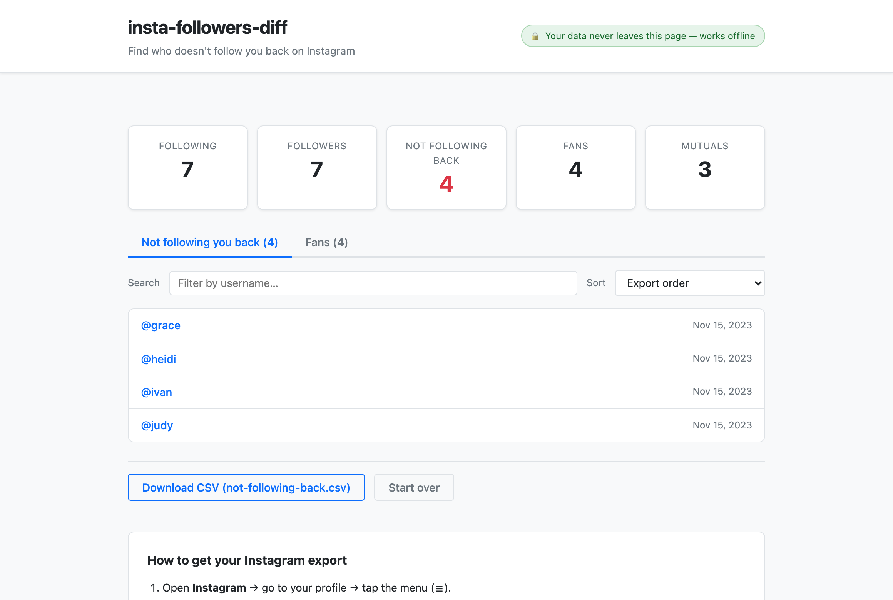

# insta-followers-diff

**Find which Instagram accounts you follow that don't follow you back — entirely in your browser.**

Live: https://furkankeremselimoglu.github.io/insta-followers-diff/



## Privacy

All processing happens in your browser. **Zero network requests.** Your data never leaves your device and works completely offline. This is enforced by a strict Content Security Policy and verified by automated CI checks on every commit.

## How to Use

### 1. Get Your Instagram Export

Follow these steps to download your followers and following list from Instagram:

1. **Open Instagram** → tap the menu icon
2. Go to **Accounts Center** → **Your information and permissions**
3. Select **Download your information**
4. Choose **Some of your information**
5. Select **only "Followers and following"** (you can ignore the others)
6. Set date range to **"All time"**
7. **Choose JSON format** (NOT HTML — see warning below)
   - **⚠️ Important:** HTML is Instagram's default format and won't work with this app. If you received HTML files instead, go back and re-request selecting JSON format.
8. Complete the request and wait for the email with your download link (this can take minutes to hours)

### 2. Load Your Data Into insta-followers-diff

Once you have your export:

- **Drag and drop** the ZIP file, or
- **Drag and drop** the extracted `connections/followers_and_following/` folder, or
- **Choose files** and select the JSON files manually

The app will parse your data and show you:

- **Not following you back:** Accounts you follow who don't follow you
- **Fans:** Accounts that follow you who you don't follow back

### 3. Download Results

Switch between the two tabs and download the list as CSV for each group (opens in Excel, Google Sheets, etc.).

Click **"Start over"** at any time to load a different export.

## FAQ

**Is this safe?**  
Yes. You're using your own official Instagram export data — no login, no upload, no third-party involvement. The app runs entirely offline in your browser.

**Why did I get HTML instead of JSON?**  
Instagram defaults to HTML format when you request an export. Go back to Accounts Center, request again, and explicitly select JSON when given the format option.

**What do the timestamps mean?**  
The "followed at" dates come directly from Instagram's export. They represent when you followed that account.

**My ZIP is huge. Why?**  
You probably exported **all your information** instead of just "Followers and following." To speed up processing, go back and request only the "Followers and following" category.

## Scraper CLI (Optional & At Your Own Risk)

This project includes an optional Python command-line tool that can fetch your followers and following using your own credentials (no official export needed).

> **⚠️ WARNING**  
> Using third-party tools to fetch Instagram data **violates the Terms of Service** and carries a **real risk of account suspension or permanent ban**. Instagram actively detects and penalizes this behavior. Use at your own risk and only if you accept full responsibility for your account.

The official export flow above is the strongly recommended approach. If you choose to use the scraper, see [scraper/README.md](scraper/README.md) for setup and usage.

## Development

### Test

```bash
npm test
```

Runs the Node.js tests (the core diff logic, parsing, CSV export, ZIP handling). No external dependencies required.

To also run the Python tests (scraper export writer):

```bash
python3 -m unittest discover -s scraper/tests
```

No external packages required for the Python tests either.

### Philosophy

- **No build step.** The web app is pure HTML + ES modules served as-is.
- **No npm dependencies.** Only the Node test runner; the browser sees a single vendored ZIP library.
- **No framework.** Core logic is testable standalone, shared between browser and Node.

See [CONTRIBUTING.md](CONTRIBUTING.md) for more details.

## License

MIT — See [LICENSE](LICENSE)
